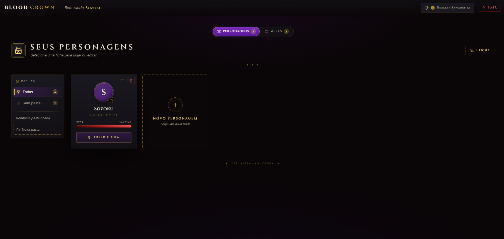
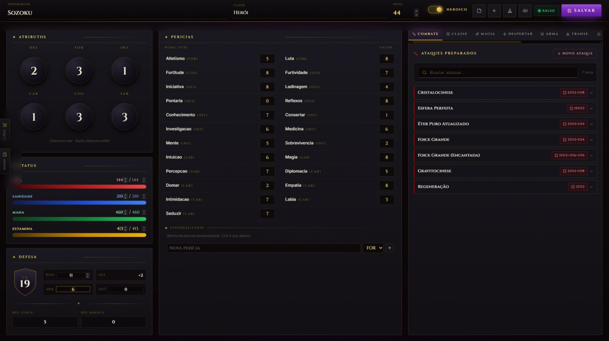
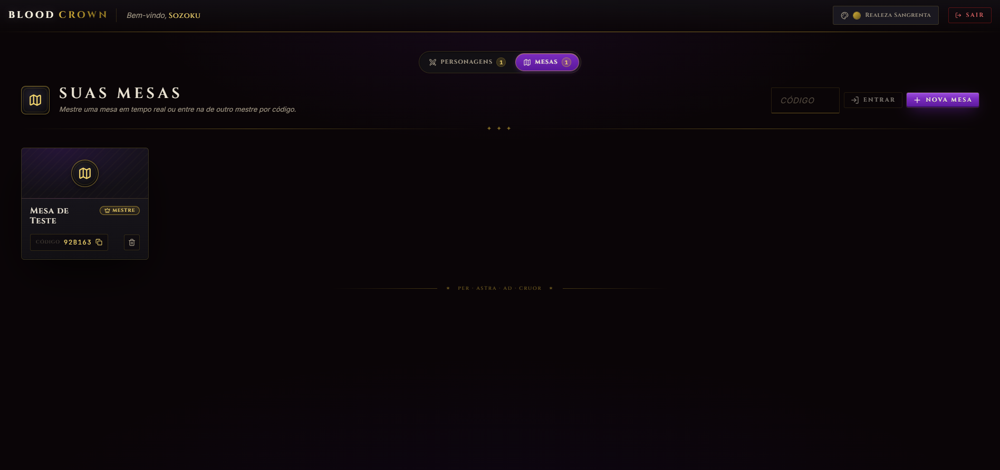
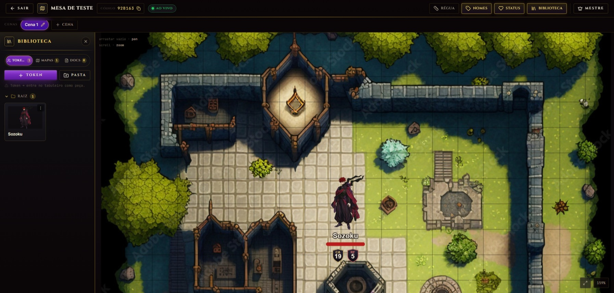

# BloodCrown — Gerenciador de Fichas de RPG

<p align="center">
  
  
  
  
  
  
  
  
  
</p>

BloodCrown é um gerenciador de fichas desenvolvido para um sistema de RPG autoral, utilizado em mesas entre amigos.

O projeto automatiza cálculos e regras que antes eram feitos manualmente, facilitando o controle dos personagens durante as sessões e reduzindo a dependência de fichas em papel.

Além do uso prático, a aplicação foi construída com foco em arquitetura, boas práticas e tecnologias amplamente utilizadas no mercado, servindo também como projeto de estudo e portfólio full stack.

> Nota: os comentários presentes no código foram elaborados com auxílio do Gemini, com o objetivo de melhorar a clareza e a documentação do projeto.

**Acesse a aplicação online:**
[https://bloodcrown.netlify.app](https://bloodcrown.netlify.app)

---

## Visão Geral

* Aplicação full stack com frontend SPA em React e backend REST
* Mesa virtual com sincronização em tempo real via WebSocket (STOMP)
* Arquitetura hexagonal, com o domínio isolado da infraestrutura
* Autenticação stateless baseada em JWT
* Persistência em banco relacional com migrações versionadas
* Containerização completa com Docker
* Deploy em ambiente de nuvem

---

## Preview

<p align="center">
  
  <br>
  <em>Dashboard — personagens organizados em pastas, com vida e nível à vista.</em>
</p>

<p align="center">
  
  <br>
  <em>Ficha — atributos, perícias, status e ataques preparados, com rolagem em um clique.</em>
</p>

<p align="center">
  
  <br>
  <em>Mesas — crie uma mesa como mestre ou entre na de outro jogador por código.</em>
</p>

<p align="center">
  
  <br>
  <em>Mesa virtual — mapa, cenas e tokens sincronizados ao vivo, com vida e escudos de defesa vindos da ficha.</em>
</p>

---

## Funcionalidades

### Mesa Virtual em Tempo Real

Tabuleiro compartilhado onde cada personagem vira um token. Ficha e tabuleiro ficam sincronizados ao vivo: o dano aplicado na ficha atualiza a barra de vida do token para todos os jogadores da mesa, e atributos alterados por buffs (como defesa e resistência) se refletem no token na hora. Implementado com WebSocket (STOMP) no backend e canvas 2D (Konva) no frontend.

### Rolagem de Dados

Cálculo automático da quantidade de dados com base nos atributos e perícias do personagem.

### Inventário

Sistema de equipar e desequipar itens, alterando automaticamente os atributos do personagem e habilitando novas opções de combate.

### Sistema de Combate

Geração dinâmica de cards de ataque de acordo com os equipamentos utilizados.

### Gestão de Recursos

Controle visual de vida, mana e estamina, com ações rápidas para cura e aplicação de dano.

### Autenticação

Sistema completo de registro e login utilizando Spring Security com autenticação stateless baseada em JWT.

### Persistência de Dados

Armazenamento das fichas e informações dos personagens em banco MySQL hospedado em nuvem.

---

## Tecnologias Utilizadas

### Backend

* Java 21
* Spring Boot 4
* Arquitetura Hexagonal + Clean Architecture
* Spring Security + JWT
* WebSocket com STOMP (sincronização da mesa em tempo real)
* Cache com Caffeine
* Hibernate / JPA
* Flyway (migrations de banco)
* MySQL 8
* Maven

### Frontend

* React 19
* TypeScript
* Vite
* React Router 7
* TanStack Query 5 (estado de servidor)
* Konva / React Konva (tabuleiro em canvas 2D)
* STOMP.js (cliente WebSocket)
* React Hook Form + Zod (validação de formulários)
* Framer Motion
* SweetAlert2

### DevOps e Infraestrutura

* Docker
* Docker Compose
* Render (API)
* Netlify (Frontend)
* Cloudinary (imagens de mapas e tokens da mesa)
* Git e GitHub

---

## Executando o Projeto Localmente

Este projeto utiliza Docker para simplificar a execução do ambiente.
Não é necessário ter Java ou MySQL instalados localmente.

### Pré-requisitos

* Git
* Docker

### Passos

1. Clone o repositório:

```bash
git clone https://github.com/R1ck-dev/BloodCrown-CharacterSheet.git
cd BloodCrown-CharacterSheet
```

2. Crie o arquivo `.env` na raiz copiando o exemplo e defina `JWT_SECRET` com um valor próprio (string longa e aleatória, pelo menos 32 bytes):

```bash
cp .env.example .env
# Edite o .env e substitua o valor de JWT_SECRET.
# Sugestão (PowerShell): [Convert]::ToBase64String((1..48 | ForEach-Object { Get-Random -Maximum 256 }))
# Sugestão (Linux/macOS): openssl rand -base64 48
```

O `docker-compose` recusa subir sem essa variável definida.

3. Suba o ambiente com Docker Compose:

```bash
docker-compose up --build
```

O Docker irá baixar as imagens necessárias, compilar o backend e iniciar os containers da aplicação.

### Acesso à aplicação

Depois que os containers subirem:

```text
Frontend: http://localhost
API:      http://localhost:8080
```

O banco MySQL é exposto na porta `3307` do host (a `3306` costuma estar ocupada por uma instalação nativa).

---

## Autor

Desenvolvido por Henrique.

* GitHub: [https://github.com/R1ck-dev](https://github.com/R1ck-dev)
* E-mail: [henriquemarangoni.inacio1108@gmail.com](mailto:henriquemarangoni.inacio1108@gmail.com)
* LinkedIn: [https://www.linkedin.com/in/henrique-marangoni-484845239/](https://www.linkedin.com/in/henrique-marangoni-484845239/)
